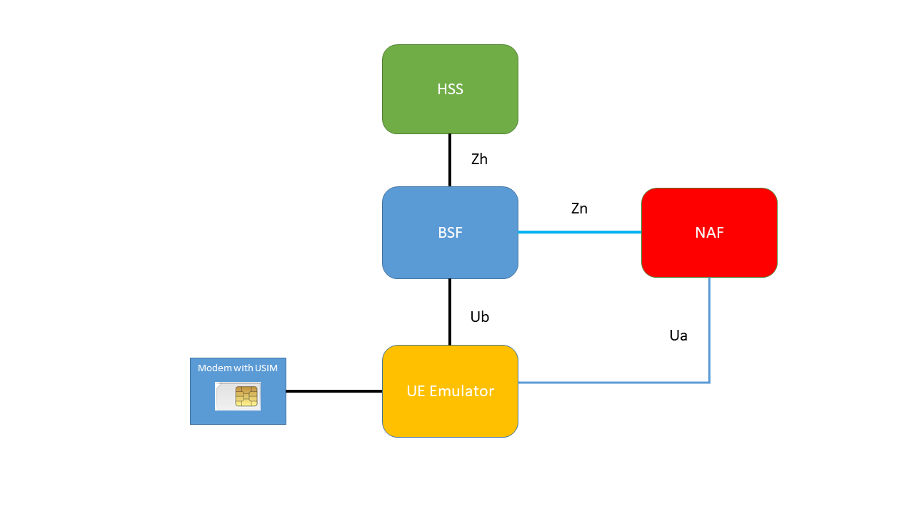
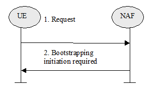
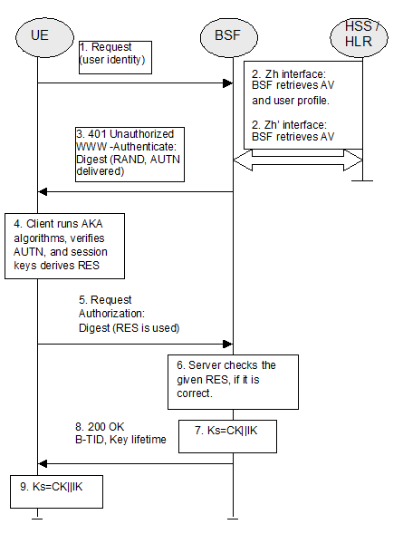
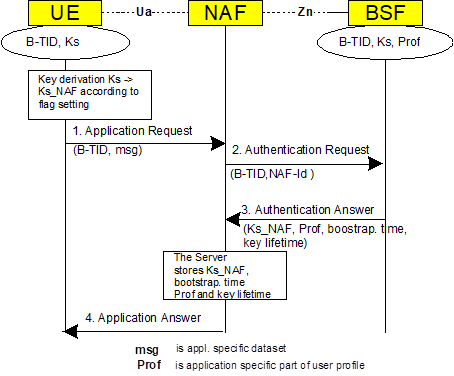

# Ut GBA_ME UE Emulator Application


This application implements a simple UE Ut emulator to retrieve the current supplementary services information of a given IMSI/MSISDN from the HSS.

Specification 3GPP 33.220 describes a mechanism, called GBA_ME, to bootstrap authentication and key agreement, which does not require any changes to the UICC.
This application implements this mechanism.

<p align="center"></p>

This is a non-trivial procedure, and to fully understand the flows, reading (at least) 3GPP 33.220 and 3GPP 24.109 is a must!

The basic flow is a 4 messages flow.
The first step is to initiate the bootstrapping with the XCAP/NAS server:

<p align="center"></p>

The second and third step is done with the BSF server:

<p align="center"></p>

And the final step is to get the application data set from the XCAP/NAS:

<p align="center"></p>

The application is written in python3, and allows a single procedure running sequentially.
The application can be changed easily to allow more advanced Ut operations.

The following items can be defined:

- MSISDN
- IMSI
- IMEI
- HTTP or HTTPS
- SIP or TEL URI
- HTTPS Cipher to use
- HTTPS certification validation 

There are default variables in the code where some of these settings can be defined (so that there is no need to put them in options in the cli).

Starting from python 3.8 the SSLContext.keylog_filename is supported, this logs TLS keys to a keylog file, whenever key material is generated or received. As stated in https://docs.python.org/3/library/ssl.html the "keylog file is designed for debugging purposes only. The file format is specified by NSS and used by many traffic analyzers such as Wireshark. The log file is opened in append-only mode. Writes are synchronized between threads, but not between processes".


# Additional Notes:

- Client needs to run AKA procedure, so once again, a modem allowing such procedures is required.

- The protocol identifier is derived from the value of the cipher suite in use.

Values were extracted from:

https://www.iana.org/assignments/tls-parameters/tls-parameters.xhtml

https://testssl.sh/openssl-iana.mapping.html


- New cipher algoriths are always being added, so this information must be updated if there is a need to test a new cipher.


# Application options:

```
root@ubuntu# python3 gba_me.py -h
Usage: gba_me.py [options]

Options:
  -h, --help            show this help message and exit
  -M MSISDN, --msisdn=MSISDN
                        MSISDN
  -I IMSI, --imsi=IMSI  IMSI (15 digits)
  -E IMEI, --imei=IMEI  IMEI-SV (16 digits)
  -u SERIAL_INTERFACE, --usb_device=SERIAL_INTERFACE
                        usb tty (e.g /dev/ttyUSBx)
  -S, --https           use HTTPS. Default is HTTP
  -T, --tel             use Tel URI instead of SIP URI in X-3GPP-Intended-
                        Identity
  -X, --unverified_context
                        Check HTTPS Certificaton. Default is not check HTTPS
  -C CIPHER_SUITE, --cipher-suite=CIPHER_SUITE
                        Define cipher suite to use with XCAP Server
root@ubuntu# 


```

This is an output example when running this application:

```
root@ubuntu# python3 gba_me.py -I 123454901000504 -M 123454900562 -u /dev/ttyUSB2 

-> First GET to NAF/XCAP Server:
   ----------------------------
	NAF/XCAP WWW-Authenticate header received:  {'Digest realm': '3GPP-bootstrapping@xcap.ims.mnc045.mcc123.pub.3gppnetwork.org', 'qop': 'auth-int', 'nonce': '428333b71bea2fdfa74f51de90f9f67d', 'opaque': 'f13e397ff5a4e15f19138ab827112c56', 'algorithm': 'MD5', 'domain': '/'}
	NAF/XCAP Data received:  b''

-> First GET to BSF Server:
   -----------------------
	BSF WWW-Authenticate headers received:  {'Digest realm': 'bsf.mnc045.mcc123.pub.3gppnetwork.org', 'qop': 'auth-int', 'nonce': 'fve4iTWb1rTb297CzVSrpwx1bsNP9gAAiCivEWFj/Po=', 'opaque': 'e1809295493786932cb220ec1c6a8630', 'algorithm': 'AKAv1-MD5'}
	BSF Data received:  b''

	RAND:  7ef7b889359bd6b4dbdbdec2cd54aba7
	AUTN:  0c756ec34ff600008828af116163fcfa

	RES:  4237C8C339014F60
	CK:  19B7CE7B4B82D5F6388AF03140A0B7D3
	IK:  56AFD0F354451A02C57A94C2A433B26E

-> Second GET to BSF Server:
   ------------------------
	BSF Authentication-Info header received:  {'qop': 'auth-int', 'rspauth': 'b8d0e59c6ed48db3a632f3daffb9aa2b', 'cnonce': '468f5b9d04a32d38', 'nc': '00000001', 'opaque': 'e1809295493786932cb220ec1c6a8630', 'nonce': 'fve4iTWb1rTb297CzVSrpwx1bsNP9gAAiCivEWFj/Po='}
	BSF Data received:  b'<?xml version="1.0" encoding="UTF-8"?>\n<BootstrappingInfo xmlns="uri:3gpp-gba">\n<btid>fve4iTWb1rTb297CzVSrpw==@bsf.ims.mnc045.mcc123.pub.3gppnetwork.org</btid>\n<lifetime>2020-10-28T23:36:26Z</lifetime>\n</BootstrappingInfo>\n'
	BTID:  fve4iTWb1rTb297CzVSrpw==@bsf.ims.mnc045.mcc123.pub.3gppnetwork.org

-> Second GET to NAF/XCAP Server:
   -----------------------------
	NAF/XCAP Response: b'<?xml version="1.0" encoding="UTF-8"?>\n<ss:simservs xmlns:ss="http://uri.etsi.org/ngn/params/xml/simservs/xcap"><ss:communication-diversion active="false"><cp:ruleset xmlns:cp="urn:ietf:params:xml:ns:common-policy"><cp:rule id="call-diversion-unconditional"><cp:conditions><ss:rule-deactivated/></cp:conditions></cp:rule><cp:rule id="call-diversion-busy"><cp:conditions><ss:rule-deactivated/><ss:busy/></cp:conditions></cp:rule><cp:rule id="call-diversion-no-reply"><cp:conditions><ss:rule-deactivated/><ss:no-answer/></cp:conditions></cp:rule><cp:rule id="call-diversion-not-reachable"><cp:conditions><ss:rule-deactivated/><ss:not-reachable/></cp:conditions></cp:rule><cp:rule id="call-diversion-anonymous"><cp:conditions><ss:rule-deactivated/><ss:anonymous/></cp:conditions></cp:rule></cp:ruleset></ss:communication-diversion><ss:incoming-communication-barring active="true"><cp:ruleset xmlns:cp="urn:ietf:params:xml:ns:common-policy"><cp:rule id="call-barring-all-incoming"><cp:conditions><ss:rule-deactivated/></cp:conditions><cp:actions><ss:allow>false</ss:allow></cp:actions></cp:rule><cp:rule id="call-barring-incoming-in-roaming"><cp:conditions><ss:rule-deactivated/><ss:roaming/></cp:conditions><cp:actions><ss:allow>false</ss:allow></cp:actions></cp:rule></cp:ruleset></ss:incoming-communication-barring><ss:outgoing-communication-barring active="true"><cp:ruleset xmlns:cp="urn:ietf:params:xml:ns:common-policy"><cp:rule id="call-barring-all-outgoing-call"><cp:conditions><ss:rule-deactivated/></cp:conditions><cp:actions><ss:allow>false</ss:allow></cp:actions></cp:rule><cp:rule id="call-barring-outgoing-international"><cp:conditions><ss:rule-deactivated/><ss:international/></cp:conditions><cp:actions><ss:allow>false</ss:allow></cp:actions></cp:rule><cp:rule id="call-barring-outgoing-internationalExHC"><cp:conditions><ss:rule-deactivated/><ss:international-exHC/></cp:conditions><cp:actions><ss:allow>false</ss:allow></cp:actions></cp:rule></cp:ruleset></ss:outgoing-communication-barring><ss:originating-identity-presentation active="true"/><ss:originating-identity-presentation-restriction active="true"><ss:default-behaviour>presentation-not-restricted</ss:default-behaviour></ss:originating-identity-presentation-restriction><ss:communication-waiting active="true"/></ss:simservs>'

```


